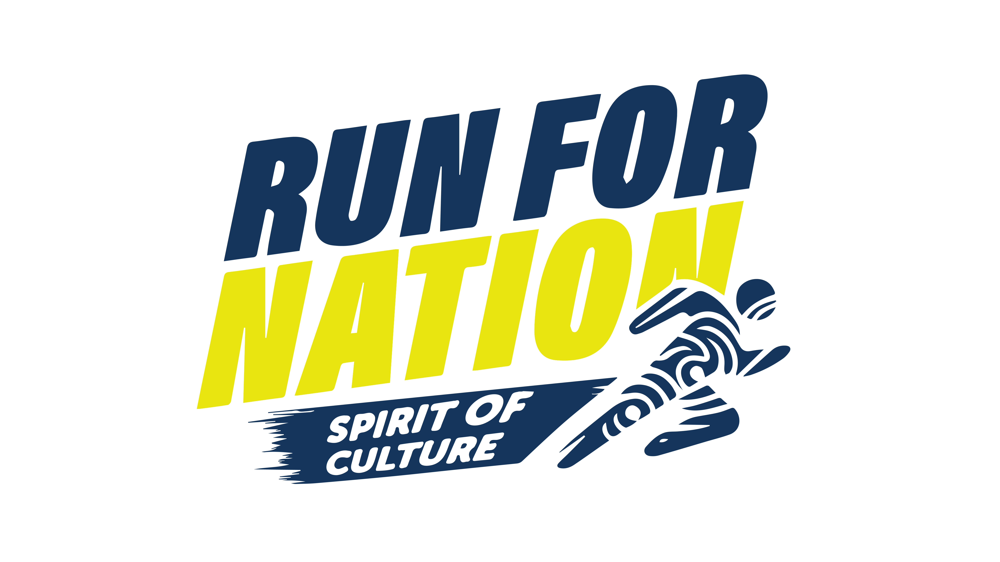

# RUNFORNATION

🏃‍♂️ RUN FOR NATION : Spirit Of Culture 2025

Run For Nation : Spirit of Culture adalah ajang Fun Run 6,2K yang menghadirkan perpaduan olahraga, budaya, dan kebersamaan, diselenggarakan di Pontianak.
Mengusung semangat “Persatuan dan Kebudayaan”, event ini bukan hanya sekadar olahraga, tetapi juga sebuah perayaan sportainment yang menampilkan kekayaan budaya daerah serta semangat persatuan bangsa.

🎯 Tentang Event

Kategori: Fun Run 6,2K

Lokasi: Pontianak & Kubu Raya

Tema: Persatuan dan Kebudayaan

Peserta: Terbuka untuk semua kalangan – pemula, komunitas, hingga atlet profesional

Peserta akan mendapatkan:
✅ Racepack eksklusif
✅ Medali finisher
✅ Produk sponsor menarik
✅ Pengalaman berlari sambil merayakan budaya

🌐 Tentang Website

Website ini dibuat untuk mendukung event Run For Nation: Spirit of Culture 2025, dengan fitur:

📌 Informasi event

📝 Pendaftaran peserta online

💳 Pembayaran & konfirmasi

📷 Galeri & dokumentasi

📢 Update berita & sponsor

⚙️ Teknologi yang Digunakan

Frontend: React + Vite

Styling: CSS / Tailwind

State Management: React Hooks / Redux (jika dipakai)

🚀 Cara Menjalankan Project

# clone repo

git clone https://github.com/rafi-zimraan/portofolio.git run-for-nation

# masuk folder

cd run-for-nation

# install dependencies

npm install

# jalankan server

npm run dev
